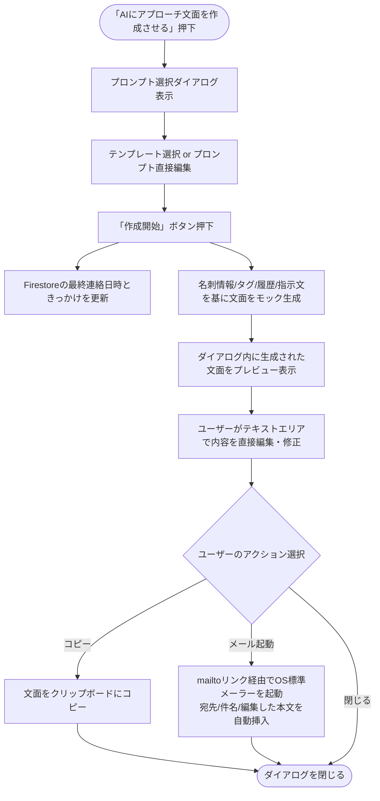

# BizKnot AIアプローチ戦略（BizKnot Strategy）仕様

本ドキュメントは、BizKnotにおける「ハイブリッド検知による最適なアプローチタイミング算出」および「AIを用いたアプローチ文面作成機能」の仕様を定義する。

## 1. ハイブリッド検知の仕様（アプローチタイミングのアラート）

名刺データのタグ情報と以下の3つの優先順位をもとに、「今連絡すべき顧客」を抽出し、アラートを上げる仕組みとする。

*   **【優先度：最高】 ニュース都度検知**
    *   **仕様:** 経過時間に関わらず、顧客企業に関するニュース（RSS等）をシステムが検知した場合、その都度「連絡のチャンス」としてサジェストする。
    *   **トリガー表示:** 「〇〇のニュースを検知」

*   **【優先度：高】 AIメール作成連動**
    *   **仕様:** アプリ内の「AIでアプローチ文面を作成させる」機能を利用した日を『最終連絡日（lastContactDate）』として記録する。そこから設定期間（デフォルト3〜6ヶ月、設定画面で1〜60ヶ月の範囲で可変）が経過した場合にアラートを出す。
    *   **トリガー表示:** 「AIアプローチ作成からXヶ月経過」

*   **【優先度：中】 名刺登録日からの経過**
    *   **仕様:** AIメール機能が一度も使われていない場合、純粋に「名刺登録日（出会った日）」を起点とし、設定期間（1〜60ヶ月）が経過したタイミングでアラートを出す。
    *   **トリガー表示:** 「名刺登録からXヶ月経過」

## 2. AIへのアプローチ文面作成指示（プロンプト）仕様

AIにアプローチ文面を作成させる際は、システムが保持するコンテキスト（背景情報）と、ユーザーが意図する指示（プロンプト）を掛け合わせて高精度な文面を生成する。

### 2.1. 文面作成に利用するデータ（インプット）
1.  **タグ情報 (Tags):** 「自社とのマッピング・AI分析」欄で設定されたタグ群。
2.  **過去の接点・プロジェクト履歴 (Project History):** 詳細画面でユーザーまたはAIが記録した取引・接点履歴。
3.  **ユーザーからのプロンプト (User Prompt):** ユーザーがダイアログ内で選択、または手動で入力した具体的な指示文（例：「丁寧な営業メールを書いてください」）。

### 2.2. プロンプト設定と選択のUI仕様
*   **設定画面 (Settings):**
    *   ユーザーは、頻繁に利用する「デフォルトプロンプト（指示文のテンプレート）」を複数パターン保存できる。
*   **詳細画面 (Detail):**
    *   「AIにアプローチ文面を作成させる」ボタンを押下すると、**プロンプト選択ダイアログ**が表示される。
    *   ダイアログ内で、設定画面で保存した「デフォルトプロンプト」を一覧から選択できる。
    *   選択したプロンプトの全量テキストがテキストエリアに表示され、ユーザーがその場で内容を確認・微調整できる。
    *   「OK（作成開始）」を押下すると、上記インプット情報（タグ＋履歴＋プロンプト）をAIに送信し、文面を生成する。

## 3. UIへの表示仕様

*   **名刺一覧画面:**
    *   **最終連絡日時:** アプローチを行った日時を表示。データ型がTimestamp型か文字列型かに関わらず、システム側で `YYYY/MM/DD HH:MM` 形式に安全にフォーマットして出力する。
    *   **連絡のきっかけ:** アプローチを行ったトリガー（理由・手段）を表示する。

*   **名刺詳細画面:**
    *   基本情報上部の目立つ位置に「最終連絡日時」と「連絡のきっかけ」をセットで表示する。

---

## 4. 「連絡のきっかけ」およびアプローチ作成の業務フロー詳細仕様

### 4.1. 「連絡のきっかけ」カラムに入る各値の仕様
「連絡のきっかけ（アプローチの動機・手段）」には、運用フェーズに応じて以下の値が自動的に記録され、一覧画面上で容易に確認できる仕様とする。

| 設定値（きっかけ） | 説明・システム要件 | 今後の運用・拡張想定 |
| :--- | :--- | :--- |
| **`AIアプローチ作成`** | 本画面の「AIにアプローチ文面を作成させる」機能を用いて営業メール下書きを生成した際に自動記録される。 | アプローチ用のメール文面が正常に作成された時点での連絡記録として扱われる。 |
| **`ニュース検知`** | 顧客企業に関する最新のニュース（RSSやクローラーが検知したプレスリリース等）を契機としてアプローチを行った場合に記録される。 | タイムリーな営業機会の最大化を図るためのきっかけとなる。 |
| **`定期連絡`** | 設定された経過月数（デフォルト3〜6ヶ月、設定で可変）を経過し、アラートに基づいてアプローチを行った場合に記録される。 | 長期放置顧客を防止し、接点を継続的に保つためのトリガーとなる。 |
| **`手動更新（テスト）`** | 開発環境・検証環境にてテスト用ボタンを用いて最終連絡日時を更新した際に記録される。 | テストおよび動作確認用。本番環境の一般ユーザー操作では使用しない。 |

### 4.2. AIアプローチ文面作成のプレビュー・編集・起動プロセス
ユーザーが詳細画面の「AIにアプローチ文面を作成させる」を押下した際のプロセスは以下の通り。

1.  **プロンプト選択・編集段階:**
    *   ユーザーは、テンプレート（設定画面で保存したもの）を選択するか、テキストエリアに直接指示を記入できる。
2.  **文面生成・プレビュー段階:**
    *   「作成開始」が押されると、最終連絡日時が更新されると同時に、モーダルが「結果画面」に切り替わり、生成された営業メールがテキストエリアに出力される。
    *   このテキストエリア内の文章は、メーラーへ送る前にその場ですぐにキーボード入力で修正できる。
3.  **アクション・送信段階:**
    *   **コピー:** 「コピーする」ボタンを押すと、クリップボードに現在テキストエリアに表示されている文面がコピーされる。
    *   **メールソフト起動:** 「メールソフト起動」ボタンを押すと、名刺に登録されているメールアドレスを宛先とし、作成された件名と、**ユーザーが編集した最新の本文**をセットした状態で、OSの既定のメールアプリ（Outlook, Gmailアプリ等）が即時起動する。

